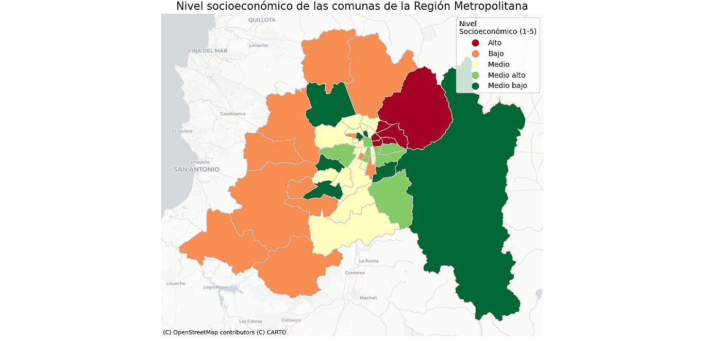

# Geospatial Analysis
## Metropolitan Region of Chile: Comunas by Socioeconomic level
## Analysis using Python and Geopandas


## Python code

## SET THE WORKING DIRECTORY
```
import os

os.chdir('work directory')
```
## IMPORT LIBRARIES
```
import pandas as pd

import geopandas as gpd

import matplotlib.pyplot as plt
```
## IMPORT THE SHAPEFILE
```
gdf = gpd.read_file('comunas.shp')
gdf
```
## DISPLAY INFORMATION ABOUT THE IMPORTED SHAPEFILE
```
print(f"{type(gdf)}, {gdf.geometry.name}")   # Displays the name of the 'geometry' column in the shapefile 

print(gdf.head())

print(gdf.geometry.geom_type.value_counts())
```
## IMPORT THE STATISTICAL DATA TO DISPLAY IN THE MAP
```
df = pd.read_csv('data.csv')

df
```
## CREATE A GEODATAFRAME (gdf) MERGING THE SHAPEFILE AND THE CSV DATA FILE.
```
full = gdf.merge(df, left_on="CUT", right_on="id_comuna")
```
## PLOT THE "GSE" VARIABLE IN A MAP
## EACH OF ITS LEVELS WILL BE DISPLAYED WITH A DIFFERENT COLOR
```
colors = 5            # The variable to display (GSE) has 5 categories
cmap = 'Blues'
figsize = (16, 10)
title = 'Metropolitan Region of Chile: comunas by Socioeconomic level, 2025' 

full.plot(column='GSE', cmap=cmap, figsize=figsize, k=colors, legend=True, aspect=1)
plt.title(title, fontdict={'fontsize': 18}, loc='center')

plt.show()
```



